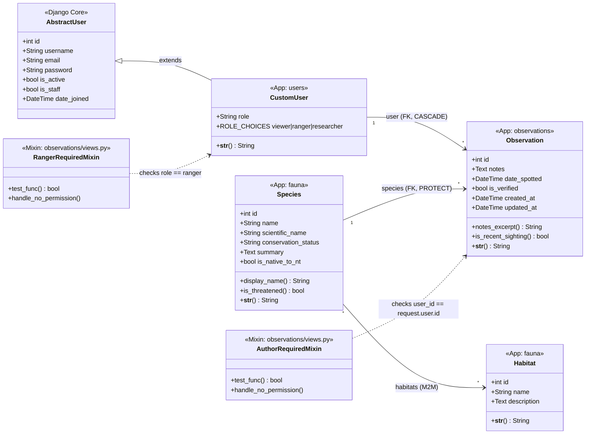

# EchoNT Object-Oriented Class Diagram

This diagram reflects the actual implementation of the EchoNT Biodiversity Monitoring system. It highlights **Inheritance** (CustomUser extends AbstractUser), **Aggregation** (Observation links User and Species), **Association** (Species ↔ Habitat M2M), and the **role-based auth model** introduced in Assessment 4.

## Auth Model Notes

| Role | Can create observations | Can edit/delete own | Can verify any |
|------|------------------------|---------------------|----------------|
| viewer | Yes (login required) | Yes | No |
| researcher | Yes (login required) | Yes | No |
| ranger | Yes (login required) | Yes | Yes |

- Role is stored directly on `CustomUser` (field: `role`) rather than via Django Groups — see [ADR 0004](../docs/0004-custom-user-model-vs-profile.md).
- Object-level permissions are enforced by `AuthorRequiredMixin` and `RangerRequiredMixin` — see [ADR 0005](../docs/0005-mixin-vs-decorator-access-control.md) and [ADR 0006](../docs/0006-object-level-permissions.md).
